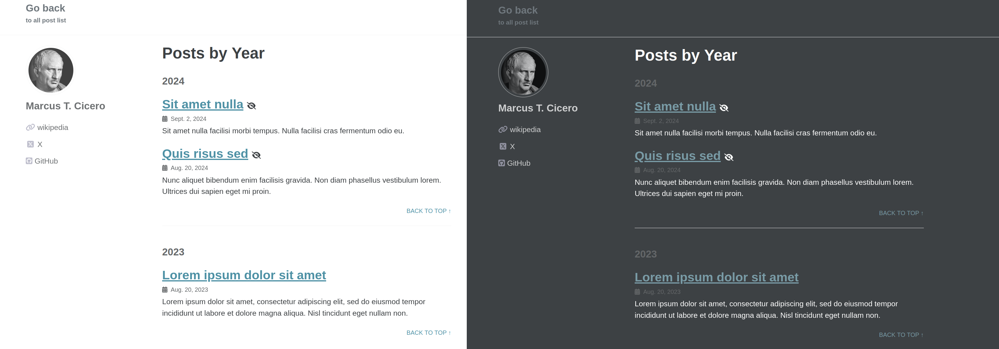

# A basic django-based blog

This Django repository serves as a framework for managing a blog website using the <a href="https://github.com/mmistakes/minimal-mistakes">Minimal Mistakes</a> templates. You can see an example of a personal blog built with this framework at [blog.henryrosales.com](https://blog.henryrosales.com).

This repository includes three example blogs located in `main/templates/posts`. Each post is associated with an instance of the Article model, which stores the post's slug and the template's location. Additionally, the repository supports both public and private posts. Private posts are only visible to authenticated users.

